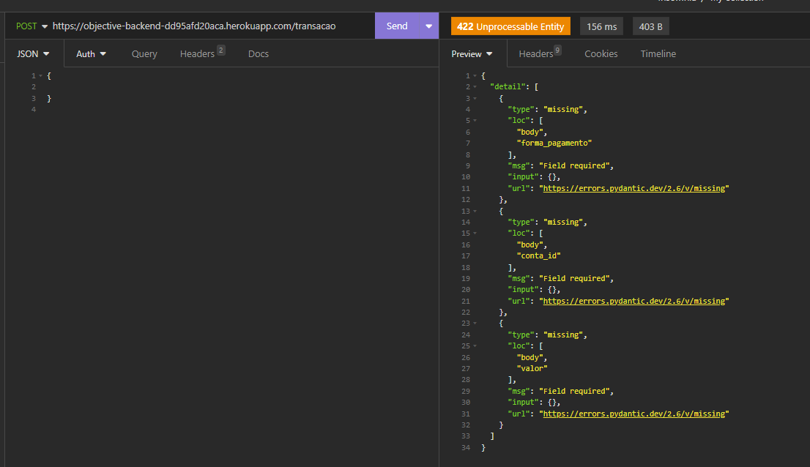
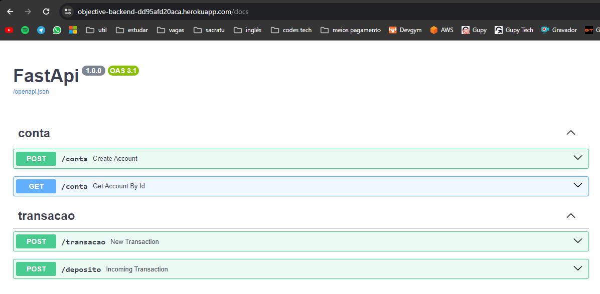

### Deploy no Heroku
https://objective-backend-dd95afd20aca.herokuapp.com/docs

<br><br>

### Validação de campos:


<br><br>

### Documentação da API:


## Executar como desenvolvedor 🧩

<br><br>

### No Windows 🪟
1 - Instalar todas as dependências
```bash
python -m venv venv
venv\Scripts\activate.bat
pip install -r requirements.txt
```

2 - Executar
```bash
venv\Scripts\activate.bat
run_dev.bat
```

### No Linux 🐧
1 - Instalar todas as dependências
```bash
python3 -m venv venv
source venv/bin/activate
pip install -r requirements.txt
```

2 - Executar
```bash
source venv/bin/activate
uvicorn app.main.main:app --reload
```
